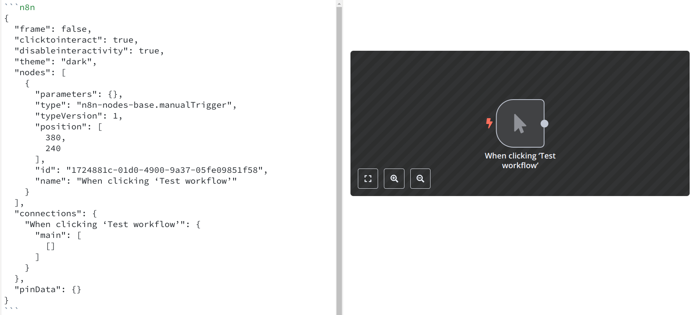

# GROWI plugin n8n

This repository contains a [GROWI](https://github.com/weseek/growi) plugin to preview n8n workflows.

## Getting Started

1. Clone this repository
2. Create a new branch

```bash
git checkout -b MY_BRANCH_NAME
```

3. Install the project dependencies

```bash
npm install
```

4. Test your build

```bash
npm run build
```

5. Commit your changes
6. Open a pull request

### Commits & Releases

#### Committing

Commits format is enforced using [Commitizen](https://github.com/commitizen/cz-cli) and follows the [AngularJS commit standard](https://github.com/angular/angular/blob/main/CONTRIBUTING.md#type).

This allows for [easier automated releases](#automated-releases)

#### Automated Releases

Releases and packages version changes are all automated using [semantic-release](https://semantic-release.gitbook.io/semantic-release).

Its configuration is available in the `.releaserc.json` file.

Make sure that the `TOKEN` action secret is configured and has access to this repository.

## Usage

In the GROWI editor, add a code block with your n8n workflow code:

```
```n8n
{
  // Parameters defined in n8nView
  "frame": true,
  "nodes": [
    ...
  ]
}
```


